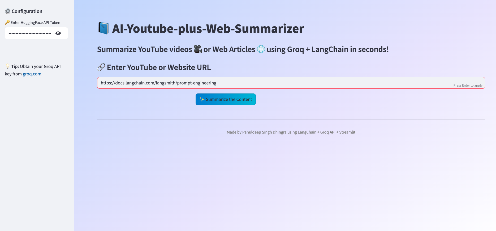
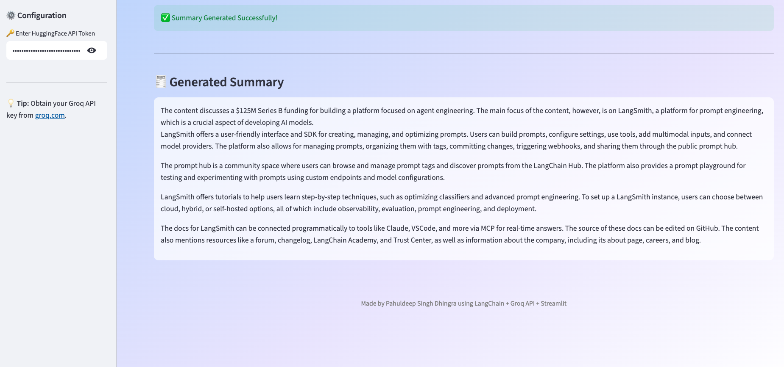

# 🧠 Generative AI Project with LangChain and Hugging Face Integration

### 📘 Web and URL Summarizer

An interactive **Streamlit** web app that instantly summarizes **YouTube videos 🎥** or **web articles 🌐** using **LangChain**, **Groq API**, and **Hugging Face LLMs**.  
Simply paste a URL, add your Hugging Face token, and get concise, high-quality summaries within seconds.

---

## 🚀 Demo

#### Home Screen
 

#### Summary Output
 


---

## 🧩 Key Features

✅ Summarizes **YouTube videos** and **web articles** in under 30 seconds  
✅ Uses **Groq LLMs** for lightning-fast text generation  
✅ Integrates **Hugging Face models** (e.g., *Mistral 7B Instruct*)  
✅ Stylish **Streamlit UI** with gradient backgrounds and responsive layout  
✅ Supports automatic transcript extraction via `youtube_transcript_api`  
✅ Includes fallback HTML scraping (using BeautifulSoup)  
✅ Modular LangChain summarization pipeline with `PromptTemplate` and `load_summarize_chain`

---

## 🏗️ Project Architecture

```text
text_summarizer/
│
├── app.py                  # Streamlit front-end & LangChain logic
├── experiments.ipynb       # Notebook for model experiments & testing
├── requirements.txt        # All required dependencies
└── images/                 # Screenshots & UI previews
```

---

## ⚙️ Installation & Setup

1️⃣ Clone the Repository
``` bash
git clone https://github.com/pahul1712/End-to-End-GenAI-Project-with-LangChain-and-HuggingFace-Intergration.git
cd End-to-End-GenAI-Project-with-LangChain-and-HuggingFace-Intergration
```
2️⃣ Create Virtual Environment
```bash
python3 -m venv venv
source venv/bin/activate   # On Windows: venv\Scripts\activate
```

3️⃣ Install Dependencies
```bash
pip install -r requirements.txt
```

4️⃣ Add API Keys (securely)
- HF_TOKEN=your_huggingface_api_token
- GROQ_API_KEY=your_groq_api_key

---

## 🧰 Tech Stack

| Category         | Tools & Libraries                                            |
| ---------------- | ------------------------------------------------------------ |
| **Framework**    | Streamlit                                                    |
| **LLM Provider** | Hugging Face Hub + Groq LLMs                                 |
| **Pipeline**     | LangChain (PromptTemplate · Summarize Chain)                 |
| **Data Loaders** | YoutubeTranscriptAPI · UnstructuredURLLoader · BeautifulSoup |
| **Styling**      | Custom CSS (gradients, responsive UI)                        |
| **Language**     | Python 3.10+                                                 |


---

## 📦 Requirements
```text
streamlit
langchain
langchain-groq
langchain-huggingface
youtube-transcript-api
beautifulsoup4
requests
validators
python-dotenv
```
